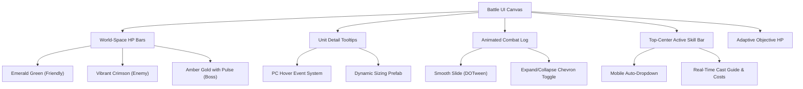

# Maou-Sama-TD: Premium Battle UI & UX Upgrade Plan

This document outlines the design architecture, technical blueprints, and step-by-step tasks to upgrade the battle interface of **Maou-Sama-TD** to a state-of-the-art, premium, and mobile-friendly experience.

---

## 🎨 Design Vision & Aesthetic Standards

To ensure a state-of-the-art, high-production-value interface:
* **Curated Harmonious Color Palettes**: Move away from flat engine colors. Use rich HSL palettes (vibrant emeralds, deep dark grays, and blazing crimson-reds).
* **Glassmorphism**: Use translucent panel backgrounds (`rgba(10, 10, 15, 0.85)`) with a fine, bright outline border (`rgba(255, 255, 255, 0.15)`) and smooth background dropshadows.
* **Micro-Animations**: Animate all interactive UI elements using smooth elastic curves (via `DOTween`).
* **Clean Modern Typography**: Use highly legible sans-serif fonts (via TextMeshPro) with appropriate outlines and shadow formatting to preserve contrast over chaotic battlegrounds.

---

## ⚔️ UI Overhaul Blueprints

### 1. Camera-Adaptive, Text-Free World-Space HP Bars
Since the tactical camera can zoom far out, standard static world-space HP bars and tiny numeric text quickly become illegible and clutter the viewport. To solve this, we will implement a pro-tier, highly adaptive system:

* **Camera-Distance Scale Compensation (Constant Screen Size)**:
  * We will add a dynamic billboard scaling script to the world-space HP bar canvas.
  * As the camera moves further away (larger distance/FOV), the script will **dynamically scale up the world-space canvas** proportionally.
  * This ensures that HP bars **maintain a constant, perfectly readable pixel width and height on the screen** regardless of whether the camera is zoomed fully in or out!
* **Text Removal & Visual Cleanliness**:
  * We will **completely remove numeric text overlays** from regular vassals and enemies in world space (preventing tiny pixelated font clutter).
  * Raw numeric health values will be **exclusively reserved** for:
    1. The high-fidelity **Unit Detail/Inspector Panel** at the bottom of the screen (on selection).
    2. Major **Elite/Boss units** that have a dedicated big HP bar at the top or side.
* **Selective Visibility (Smart Toggle)**:
  * HP bars are **hidden by default** when a unit is at full health (100% HP) to keep the battleground clean and beautiful.
  * The bar automatically fades/slides into view once the unit takes damage (< 100% HP), or when the player manually selects/highlights the unit.
  * It fades out smoothly (over **0.4s**) if the unit is healed back to full or after combat ends.
* **Segment Notch Markers (Visual HP Scale)**:
  * To give players an instant reading of a unit's total durability without relying on text, we will implement **segmented health ticks/notches** (similar to *League of Legends* or *Arknights*).
  * A tick marker is drawn every 100 Max HP (for standard units) or every 500 Max HP (for elite/boss units).
  * This allows the player to instantly distinguish between a squishy 100-HP scout and a beefy 800-HP vanguard at a single glance, from any distance!
* **Semantic Color Coding**:
  | Target | Fill Color | Background Color | Special Effects |
  | :--- | :--- | :--- | :--- |
  | **Friendly Vassals** | `Emerald Green (#2ECC71)` | `Deep Gray (#1A252C)` | Standard flat bar with segments |
  | **Regular Enemies** | `Crimson Red (#E74C3C)` | `Deep Gray (#1A252C)` | Standard flat bar with segments |
  | **Bosses / Elites** | `Amber Gold (#F1C40F)` | `Dark Charcoal (#0F0F0F)` | Pulsing outline glow shader + wider bar + major segments |

### 2. PC Hover Tooltips for Skills & Ultimates
Adding support for hover tooltips on PC across both the Sovereign Rites panel and the Unit Stats/Inspector panel.

* **The Reusable Tooltip Prefab (`SkillTooltipUI`)**:
  * Container panel with Vertical Layout Group and Content Size Fitter.
  * **Header Area**: Skill Name in large font, with a color matching its damage/type tier.
  * **Cost Area**: Display of seal costs (`Seals` icon + quantity) or cooldown times.
  * **Body Area**: Rich text supporting custom formatting tags (e.g., `Deals <color=#ff6600>Fire</color> damage equal to <color=#e74c3c>250% Atk</color>`).
* **Event Integration**:
  * Implement `IPointerEnterHandler` and `IPointerExitHandler` on:
    * `SkillButtonUI` (Sovereign Rites buttons).
    * Skill slots in `UnitInspectorSkillsPanel`.
  * Instantiate/enable the tooltip positioned dynamically relative to the pointer or button bounds.

### 3. Expandable & Dockable Combat Log Panel
* **Toggle Interface**:
  * Add a small, premium circular or vertical button (e.g. displaying a scroll/log icon) at the edge of the screen.
  * On click, toggle a state boolean `_isLogExpanded`.
* **Animation Blueprint**:
  * Utilize `DOTween` to slide the panel smoothly from its hidden position off-screen (or collapsed width) to its active position over **0.3s** using `Ease.OutBack`.
  * Rotate the button's toggle chevron icon by **180 degrees** on click to indicate the expand/collapse direction.

### 4. Objective HP (Sovereign Wagon, Tina, Sovereign) Sizing & Polish
* **Dynamic Title Theme**:
  * Keep the centralized top-center placement (re-anchored to prevent aspect ratio drift).
  * Use a custom-themed decorative frame border that swaps dynamically based on the current active level's theme:
    1. **Level 1 (Cargo Wagon)**: Medieval oak & iron trim.
    2. **Level 2 (Tina)**: Glistening magical runic frame.
    3. **Level 3 (Sovereign)**: Demonic crimson-gold horned frame.

### 5. Mobile-Friendly Active Skill Details (Dropdown Info Bar)
Hover tooltips do not work on touchscreens. To ensure a pristine mobile experience:

* **Dropdown Info Panel (`ActiveSkillDetailsUI`)**:
  * Positioned at the top-middle/top-right of the screen (or docking nicely under the objective health bar).
  * Outfitted with a translucent glass background, golden text name, cost marker, and a short cast instruction.
* **Auto-Activation Logic**:
  * When a Sovereign Rite is **Toggled** or **Dragged** (via `OnPointerClick` or `OnBeginDrag` in `SkillButtonUI`):
    * Pop/slide down the `ActiveSkillDetailsUI` from the top of the screen over **0.25s** with `Ease.OutQuad`.
    * Populate the details with the active skill’s data and cast directions (e.g., *“Empower: Drag and drop onto a friendly unit to cast.”*).
  * When the skill is **Deselected, Cast, or Released** (via `DeselectSkill` in `InteractionManager` or `OnEndDrag`):
    * Slide the dropdown back up off-screen over **0.25s** with `Ease.InQuad`.

---

## 📐 Spatial Layout & Overlap Prevention (Screen Anchor Matrix)

To guarantee that remade UI components and brand-new elements never overlap across varying screen resolutions (16:9, ultrawide, or mobile notch ratios), we establish a strict **Screen Anchor Matrix**:

| Screen Anchor | Active Component | New/Remade Element | Overlap Resolution Rules |
| :--- | :--- | :--- | :--- |
| **Top-Left** | `Authority` (Seals Counter) | *Static HUD* | Stays in the absolute top-left corner, fully independent. |
| **Top-Center (Top)** | `BaseHP` (Objective HP) | *Remade Frame* | Locked to absolute top-center. Swaps decorative frames based on level theme. |
| **Top-Center (Mid)** | `ActiveSkillDetailsUI` | **[NEW] Dropdown** | Slides down from the top, but has a vertical offset anchor so it sits **directly below** the `BaseHP` bar without covering it. |
| **Top-Center (Low)** | `DialogueUI -> MiniTopPanel` | *Repositioned Panel* | Mid-combat dialogue bubble is shifted to sit below both the `BaseHP` bar and the active skill dropdown. |
| **Top-Right** | Time Controls (Pause/Speed) | *Static HUD* | Independent, compact button group in the top-right corner. |
| **Middle-Left** | `SOVEREIGN_RITES_SKILLS_UI` | *Slide Panel (Remade)* | Slides out horizontally from the left edge on demand. |
| **Middle-Right** | `CombatLogUI` | **[NEW] Slide Panel** | Placed on the middle-right. Slides out horizontally from the right edge. Collapses to a tiny 40px icon when closed. |
| **Bottom-Left** | `UnitHolderPanel` (Vassal Cards) | *Horizontal Deck* | Anchored at absolute bottom-left with safe-area padding for mobile notches. |
| **Bottom-Right** | `Unit_Inspector_UI` | *Inspect Panel* | Slides open from the bottom-right when a vassal is clicked. |
| **Bottom-Right (Corner)** | Camera Controls (Lock, 2D/3D) | *Static Buttons* | Stacked neatly at the absolute corner, sliding out of view temporarily when the `Unit_Inspector_UI` is open. |

### 🔄 Interactive Overlap Resolution Logic

1. **Active Skill Dropdown vs. Mid-Combat Banter (Top-Center)**:
   * If a mini-dialogue bubble is active *and* the player starts dragging a Sovereign Rite:
   * The `DialogueUI` will temporarily fade its opacity to **25%** and shift down, allowing the golden `ActiveSkillDetailsUI` text to take visual priority.
   * Once targeting is complete/released, `DialogueUI` restores to 100% opacity.

2. **Combat Log vs. Vassal Inspector (Right Side)**:
   * The `CombatLogUI` sits at the middle-right. The `Unit_Inspector_UI` slides up from the bottom-right.
   * If both are open, the Combat Log automatically collapses to its icon-only mode to prevent crowding, then restores itself once the inspector is closed.

3. **Compact Wave & Enemy Tracker Placement**:
   * We integrate the `WaveNumberText` (e.g. "Wave 1/3") and the `WaveEnemyCountText` (e.g., "Enemies: 12") as neat, horizontal pill badges anchored directly adjacent to the top-center `BaseHP` bar (left and right flanks), rather than loose floating texts.

---

## 📅 Implementation Checklist

### Phase 1: Foundation & Prefabs
- [ ] Create `SkillTooltipUI` Prefab with custom layout scripting and support for rich text.
- [ ] Design high-visibility world-space HP bar materials/sprites (Emerald/Crimson/Amber).
- [ ] Create `ActiveSkillDetailsUI` top-dropdown bar prefab.

### Phase 2: Scripts & Core Integration
- [ ] Update `UnitBase.cs` to integrate high-contrast color settings and optional text toggles.
- [ ] Update `UnitInspectorSkillsPanel.cs` and `SkillButtonUI.cs` to trigger PC hover tooltips.
- [ ] Implement `ActiveSkillDetailsUI.cs` and connect it to `InteractionManager` events (on skill selected/deselected).
- [ ] Update `CombatLogUI.cs` to support smooth slide expand/collapse docking.

### Phase 3: Polish & Polish
- [ ] Add elastic bounce feel to all HUD HUD buttons on hover/press.
- [ ] Validate mobile touch/drag mechanics to ensure top dropdown operates perfectly without performance cost.
- [ ] Conduct final round of automated/visual tests in-editor.
