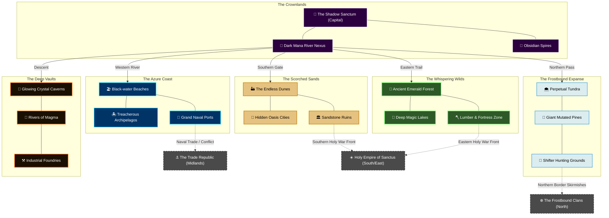

# Topological Map of Drakmora

Below is the detailed geographic topology of the Kingdom of Drakmora and its surrounding borders.

```mermaid
graph TD
    %% Styling for biomes
    classDef center fill:#2c003e,stroke:#fff,stroke-width:2px,color:#fff;
    classDef north fill:#dcedf0,stroke:#55aade,stroke-width:2px,color:#000;
    classDef south fill:#e6c280,stroke:#c48211,stroke-width:2px,color:#000;
    classDef east fill:#2d5a27,stroke:#66ff66,stroke-width:2px,color:#fff;
    classDef west fill:#003366,stroke:#00ccff,stroke-width:2px,color:#fff;
    classDef under fill:#1a0f00,stroke:#ff6600,stroke-width:2px,color:#fff;
    classDef external fill:#4a4a4a,stroke:#000,stroke-width:1px,color:#fff,stroke-dasharray: 5 5;

    %% Exterior Continents/Borders
    FC["❄️ The Frostbound Clans (North)"]:::external
    TR["⚓ The Trade Republic (Midlands)"]:::external
    HES["☀️ Holy Empire of Sanctus (South/East)"]:::external

    %% Central Drakmora
    subgraph The Crownlands
        Capital["🏰 The Shadow Sanctum (Capital)"]:::center
        Nexus["💜 Dark Mana River Nexus"]:::center
        Obsid["🌋 Obsidian Spires"]:::center
        
        Capital --- Nexus
        Capital --- Obsid
    end

    %% Northern Province
    subgraph The Frostbound Expanse
        Tundra["🌨️ Perpetual Tundra"]:::north
        Pine["🌲 Giant Mutated Pines"]:::north
        Hunting["🐺 Shifter Hunting Grounds"]:::north
        
        Tundra --- Pine
        Pine --- Hunting
    end

    %% Eastern Province
    subgraph The Whispering Wilds
        Forest["🌳 Ancient Emerald Forest"]:::east
        Lakes["🌊 Deep Magic Lakes"]:::east
        Lumber["🪓 Lumber & Fortress Zone"]:::east

        Forest --- Lakes
        Forest --- Lumber
    end

    %% Southern Province
    subgraph The Scorched Sands
        Dunes["🏜️ The Endless Dunes"]:::south
        Oasis["🌴 Hidden Oasis Cities"]:::south
        Ruins["🏛️ Sandstone Ruins"]:::south

        Dunes --- Oasis
        Dunes --- Ruins
    end

    %% Western Province
    subgraph The Azure Coast
        Beaches["🏖️ Black-water Beaches"]:::west
        Archipelago["🏝️ Treacherous Archipelagos"]:::west
        Ports["🚢 Grand Naval Ports"]:::west

        Beaches --- Ports
        Beaches --- Archipelago
    end

    %% Underground
    subgraph The Deep Vaults
        Crystals["💎 Glowing Crystal Caverns"]:::under
        Magma["🌋 Rivers of Magma"]:::under
        Forge["⚒️ Industrial Foundries"]:::under

        Crystals --- Magma
        Magma --- Forge
    end

    %% Internal Connections
    Nexus -->|Northern Pass| Tundra
    Nexus -->|Eastern Trail| Forest
    Nexus -->|Southern Gate| Dunes
    Nexus -->|Western River| Beaches
    Nexus -->|Descent| Crystals

    %% External Connections (Borders)
    Hunting -.->|Northern Border Skirmishes| FC
    Ports -.->|Naval Trade / Conflict| TR
    Ruins -.->|Southern Holy War Front| HES
    Lumber -.->|Eastern Holy War Front| HES

```
