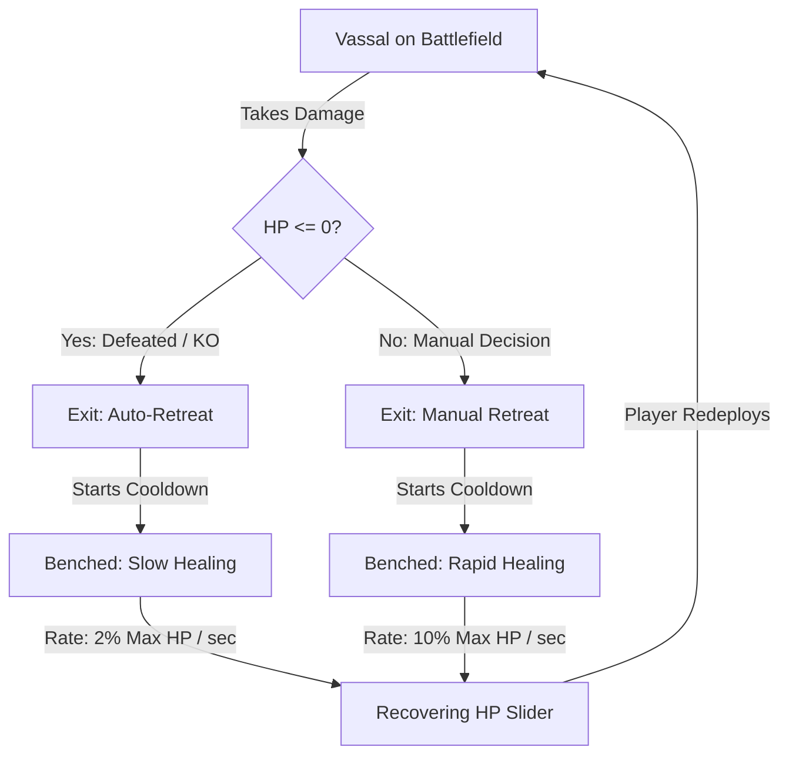

# Vassal Bench Healing & Cooldown System

To provide tactical depth, prevent redeployment exploits, and reward strategic retreat, the combat design enforces **Persistent Health States** and **Differential Passive Healing** on all Vassal characters in the player's cohort.

---

## The Core Design Problem: Redeploy Exploits
In standard Tower Defense games where units can be retreated and immediately redeployed, players can bypass high-ground/low-ground healing needs by repeatedly:
1. Waiting for a unit to drop to low health.
2. Manually retreating them to refund seals.
3. Instantly placing them back down with full health.

This removes tension, renders dedicated healer classes obsolete, and trivializes difficult wave encounters.

---

## The Solution: Persistent Health & Bench Healing

The system tracks every Vassal's health ratio ($0.0$ to $1.0$) across deployments. When a unit is benched (retreated or defeated), their health **does not reset**. Instead, it is persisted on the `DeploymentUI` and slowly recovers over time based on *how* they exited the active battlefield.

### 1. Persistent Health State
- When a unit is spawned on a grid tile, they begin with their stored **Benched HP Ratio**.
- While active, their health bar on the field and their live HP slider overlay on the card update dynamically.
- When retreated or defeated, their current health percentage is recorded.

### 2. Differential Passive Bench Healing Rates
While benched or on cooldown, Vassals passively regenerate their health according to two distinct states:

| Exit State | Healing Rate | Time to Full HP from 0% | Design Rationale |
| :--- | :--- | :--- | :--- |
| **Manual Retreat** | **10% Max HP / second** | **10 seconds** | Rewards proactive players who save their units before they are completely knocked out. |
| **Defeat / KO** | **2% Max HP / second** | **50 seconds** | Penalizes reckless play, making full recovery take significantly longer if a unit is defeated by enemies. |

### 3. Real-Time UI Feedback: Bottom Slider Overlay
To ensure visual excellence, the deployment bar cards have been upgraded with a procedural, glassmorphic HP slider bar aligned to the bottom area of each unit button card:
- **Active State (Deployed)**: Displays the live combat health of the unit on the battlefield, warning the player when their deployed vassal is close to death.
- **Benched State (Recovering)**: Shows the progress of passive bench-healing in real-time, allowing players to visually judge when a benched character has healed enough for redeployment.

---

## Technical Architecture & Flow

The system is implemented as a clean, event-driven architecture decoupled from direct state mutations:

1. **`PlayerUnit.Die` / `Retreat`**:
   - `PlayerUnit` overrides the abstract death handler to raise the `OnRetreat` event back to the `DeploymentUI` manager.
   - Saves current live health ratio or triggers death state.

2. **`DeploymentUI.Update`**:
   - Updates live HP ratios for active units on the grid.
   - Applies the passive healing ticks to undeployed units depending on their `_isManuallyRetreated` flag.
   - Drives real-time slider UI updates.

3. **`UnitButtonUI.CreateProceduralHpSlider`**:
   - Instantiates a clean, bottom-stretching UI Slider procedurally if not assigned in the inspector.
   - Features a high-contrast dark-slate background with a neon-teal healing progress slider bar for visual pop.
